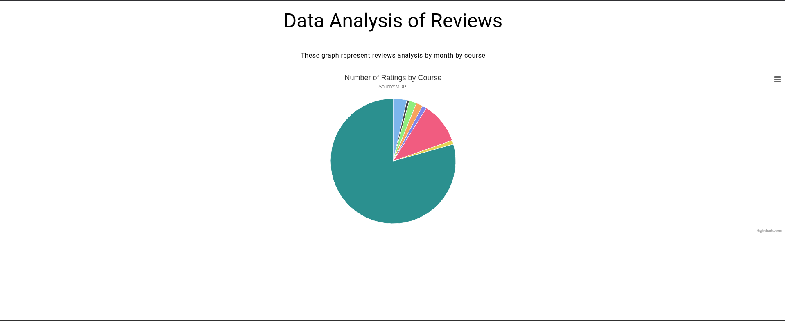
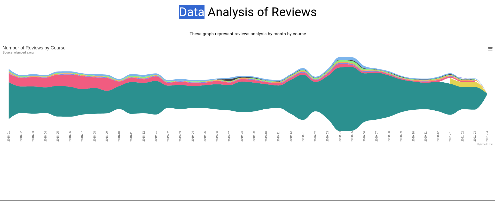
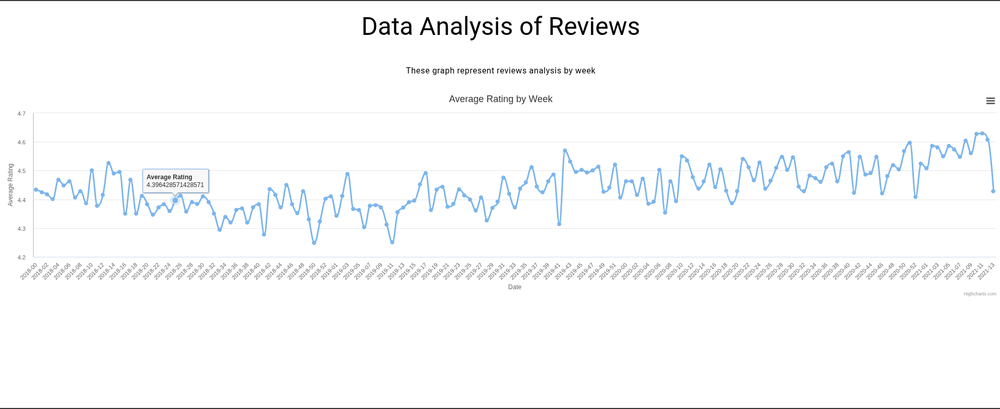

# 📊 Course Reviews Visualization Dashboard

## 📝 Project Overview
This project analyzes course review data using **Python** and **Justpy** to create interactive visualizations powered by **Highcharts**.  
The dashboard consists of three distinct visualizations providing insights into course ratings over time and distribution patterns.

---

## 🌟 Features

### 1️⃣ Weekly Average Rating Trend


- **Visualization:** Spline chart showing average rating trends  
- **Timeframe:** Weekly analysis  
- **Data Processing:**
  - Parses timestamps to extract week numbers
  - Calculates weekly average ratings
- **Key Insight:** Identifies rating trends and fluctuations over time

---

### 2️⃣ Monthly Review Volume by Course


- **Visualization:** Streamgraph showing review volume distribution
- **Timeframe:** Monthly analysis
- **Data Processing:**
  - Groups reviews by month and course
  - Counts reviews per course per month
- **Key Insight:** Shows popularity trends of different courses over time

---

### 3️⃣ Course Rating Distribution


- **Visualization:** Interactive pie chart
- **Data Processing:**
  - Groups reviews by course
  - Counts total ratings per course
- **Key Insight:** Illustrates the market share of different courses based on review volume

---

## 📦 Requirements
- Python 3.7+

Install required packages:
```bash
pip install justpy pandas pytz
```
## 📄 Data Format
The system expects a CSV file named `reviews.csv` with the following columns:
- `Timestamp` (datetime)
- `Rating` (numeric)
- `Course Name` (text)

---

## 🚀 How to Run
1. Install dependencies:
```bash
pip install justpy pandas pytz
```
2. Run any visualization script:
```bash
python 0-spline-graph-av-rating-week.py
```
3. Access the dashboard at:  
[http://localhost:8000](http://localhost:8000)

---

## 🧩 Technical Architecture
Diagram and code structure (to be added).

---

## 🎨 Customization Options
- **Chart Styling:** Modify chart definitions in each script
- **Time Periods:** Adjust date formatting strings to change granularity
- **Data Selection:** Change groupby operations to explore other insights

---

## 📈 Applications
- Identify popular courses over time
- Detect rating trends and fluctuations
- Compare course performance
- Optimize course offerings based on user feedback
- Visualize market share by course